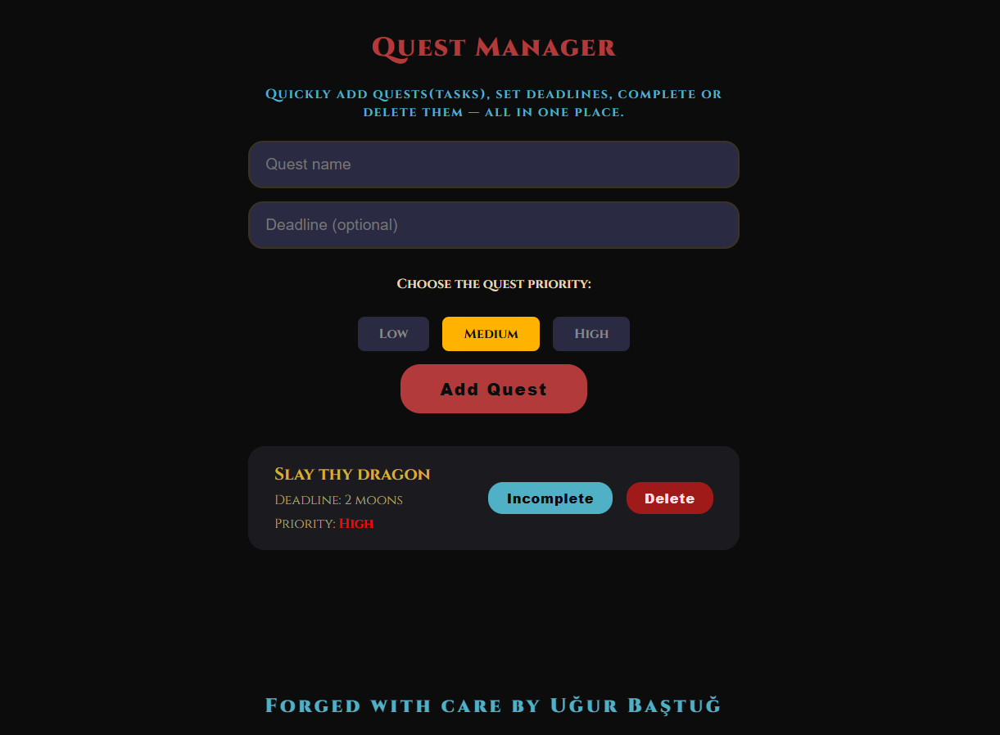

# Overview of my Task Manager

This is a web-app I made so users can easily set a task (quest) for themselves and optionally
add a deadline, then select a priority and finally Add Quest button to save it in a database.
Users can also mark done/incomplete their tasks, or delete them if they wish.

## Why "Quest Manager"?

The "Quest Manager" will welcome you to the web page, despite the project being labeled a task manager.
I wanted a unique spin on the general "to-do" app concept, this way task setting is somewhat
gamified, increasing the possibility of a user reusing the app again in the future.

## Stacks used

- Python 3.11.x+
- FastAPI
- pytest
- Docker
- uvicorn
- SQLite

## Features

- Add a task
- Optinally choose a deadline (Users are allowed to enter any strings they want for creativity)
- Toggle a task completed or incomplete 
- Delete a task (A pop-up appears for confirmation)

## The "Quest Manager" in action

## How to run

1. Fork my repo via GitHub
2. Navigate to your projects folder or its equivalent
3. Clone my repo at https://github.com/YOUR-USERNAME/task-manager using a Git interface of your preference (I use Git Bash)
4. Navigate to project root
5. Launch a terminal, then create & activate a Python environment 
(highly recommended, double-check that you're on the correct venv)
6. Install requirements: `pip install -r requirements.txt`  
7. Start server: uvicorn main:app --reload

To test endpoints via Swagger UI, navigate to: http://127.0.0.1:8000/docs

To use the app, navigate to http://127.0.0.1:8000, or use the deployed live demo: https://task-manager-7jyz.onrender.com

### License
MIT © Uğur Baştuğ
